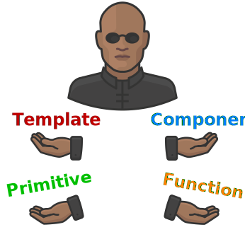

# Polymorpheus

[](https://npmjs.com/package/@taiga-ui/polymorpheus)
[](https://app.codecov.io/gh/taiga-family/ng-polymorpheus/tree/master/projects)
[](https://github.com/taiga-family/angular-open-source-starter)
[](https://t.me/taiga_ui)

**Polymorpheus** is a tiny library for polymorphic templates in Angular.

It is 1 KB gzip, dependency free and allows you to make pretty cool things.



## What does it do?

It abstracts over different ways of view customization in Angular with one simple _structural directive_:

```html
<ng-container *polymorpheusOutlet="content as text; context: context">{{text}}</ng-container>
```

**Content** accepts:

- primitives like `number` or `string`
- functions that take `context` as argument and return a primitive
- templates that get instantiated with given `context`
- components that would get `context` injected through DI

**Context** is optional when you need your **content** to adapt to the situation

## How to use it?

Typical use case would be a component that accepts visual customization and defines context by itself. Say a menu list
where you can configure how each item should look like by passing a template. And context would be item itself and, for
example, whether it is focused or not.

Please see [extensive demo](https://stackblitz.com/edit/polymorpheus-demo) (wait for packages to install and run
`npm start`).

You can also
[read about this concept in detail](https://medium.com/angular-in-depth/agnostic-components-in-angular-2427923b742d).

### Accessing context in dynamic component

If you use component content you can inject context with `POLYMORPHEUS_CONTEXT` token.

**Important!** This object is _live_ so if you change it, your component will not be recreated:

```ts
@Component({
  template: `
    {{ context.active }}
  `, // <-- this will automatically update
  changeDetection: ChangeDetectionStrategy.OnPush,
})
export class MyComponent {
  constructor(@Inject(POLYMORPHEUS_CONTEXT) readonly context: {active: boolean}) {}
}
```

### Adding type to template context

You can use `polymorpehus` directive to add type to template context:

```typescript
readonly context!: { $implicit: number };
```

```html
<ng-template
  #template="polymorpheus"
  [polymorpheus]="context"
  let-item
>
  {{ item.toFixed(2) }} <-- type 'number'
</ng-template>
```

## Core team

<table>
    <tr>
       <td align="center">
            <a href="https://twitter.com/waterplea"
                ><br /><b>Alex Inkin</b></a
            >
            <div style="margin-top: 4px">
                <a
                    href="https://twitter.com/waterplea"
                    title="Twitter"
                    ></a>
                <a href="https://github.com/waterplea" title="Github"
                    ></a>
                <a
                    href="https://t.me/waterplea"
                    title="Telegram"
                    ></a>
            </div>
        </td>
        <td align="center">
            <a href="https://twitter.com/marsibarsi"
                ><br /><b>Roman Sedov</b></a
            >
            <div style="margin-top: 4px">
                <a
                    href="https://twitter.com/marsibarsi"
                    title="Twitter"
                    ></a>
                <a
                    href="https://github.com/marsibarsi"
                    title="GitHub"
                    ></a>
                <a
                    href="https://t.me/marsibarsi"
                    title="Telegram"
                    ></a>
            </div>
        </td>
    </tr>
</table>

**ng-polymorpheus** is a part of [Taiga UI](https://github.com/taiga-family/taiga-ui) libraries family which is backed
and used by a large enterprise. This means you can rely on timely support and continuous development.
